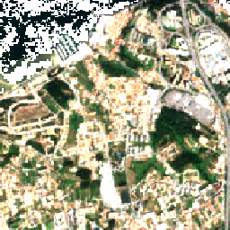
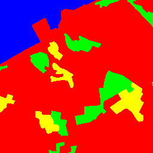
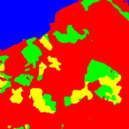
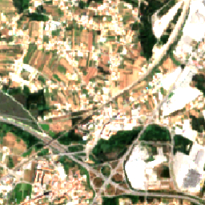
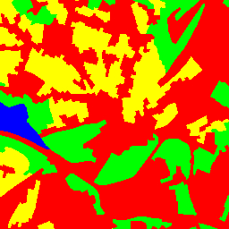
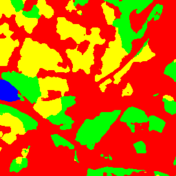
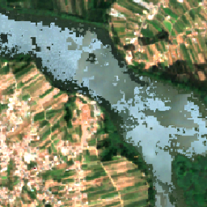
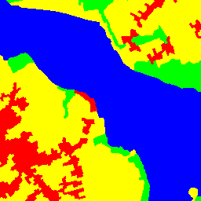

# SatForest

https://user-images.githubusercontent.com/19577316/119209549-192edc80-ba9f-11eb-9324-06748a1d9227.mp4

Diogo Nunes

José Henrique Brito

A prototype application for Land Use/Land Cover classification from satellite images

Satellite data provided by www.tesselo.com

The neural network model in this work is strongly inspired on zhixuhao's unet repo: https://github.com/zhixuhao/unet

|Satellite|Groundtruth|Result|
|:-------:|:---------:|:----:|
|  |  | |
|  |  | |
|  |  | |

## Installation
Setup a virtual environment

Download GDAL 2.4.1 binary:
https://download.lfd.uci.edu/pythonlibs/s2jqpv5t/GDAL-2.4.1-cp36-cp36m-win_amd64.whl

Download rasterio 1.0.23 binary:
https://storage.googleapis.com/pypi.naturalcapitalproject.org/wheels/rasterio-1.0.23-cp36-cp36m-win_amd64.whl

```pip
pip install -r requirements.txt
pip install GDAL-2.4.1-cp36-cp36m-win_amd64.whl
pip install rasterio-1.0.23-cp36-cp36m-win_amd64.whl
```
